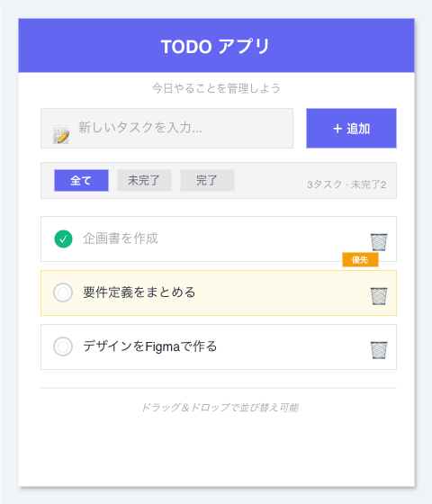

# 機能要件定義書

| 項目 | 内容 |
|------|------|
| プロジェクト | TODOアプリ |
| バージョン | 1.0.0 |
| 最終更新 | 2026-05-18 |

## 1. タスク一覧画面

### 要件リスト

| ID | 要件 | 優先度 | ステータス |
|----|------|--------|-----------|
| FR-01 | ユーザーが「新しいタスクを入力...」欄にテキストを入力できる | 高 | 未実装 |
| FR-02 | ユーザーが「追加」ボタンをクリックすると、新しいタスクが一覧に追加される | 高 | 未実装 |
| FR-03 | ユーザーがタスク横のチェックボックスをクリックすると、完了状態が切り替わる | 高 | 未実装 |
| FR-04 | ユーザーがタスク横の🗑ボタンをクリックすると、そのタスクが削除される | 高 | 未実装 |
| FR-05 | ユーザーが「全て」「未完了」「完了」フィルターを選択できる | 中 | 未実装 |

### 受け入れ基準（FR-02）

- [ ] タスク追加後、入力欄が空になること
- [ ] 空文字のタスクは追加できないこと
- [ ] 追加後に一覧の最下部に表示されること

## 2. スコープOUT

- タスクの期限設定
- カテゴリ/ラベル機能
- 複数ユーザー間の共有
